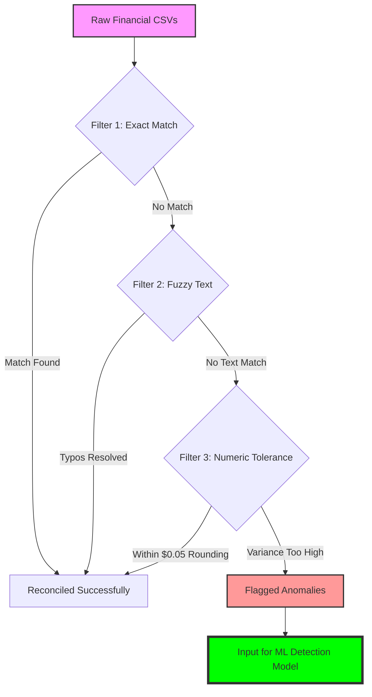

# Automated Financial Reconciliation Pipeline

[](https://www.python.org/)
[](https://github.com/)

## 📌 Project Overview
Manual financial reconciliation is a high-risk, time-consuming process prone to human error and oversight. This project implements an **Automated Financial Reconciliation Pipeline** designed to identify discrepancies between internal records and external statements with high precision.

By utilizing a **"3-Tier Sieve"** approach, the pipeline filters out expected matches and minor variances, allowing analysts to focus exclusively on high-probability anomalies detected by Machine Learning.

---

## ⚙️ How It Works: The "3-Tier Sieve"
The core logic of this pipeline is designed to reduce "noise" by processing data through increasingly complex filters before flagging an entry for manual review.



### Technical Highlights:
1.  **Exact Matching:** Instantly reconciles transactions with identical IDs and amounts.
2.  **Fuzzy String Logic:** Uses string similarity algorithms to catch typos in vendor names or descriptions (e.g., "Amzn" vs "Amazon").
3.  **Numeric Tolerance:** Accounts for standard accounting variances, such as bank rounding errors (up to $0.05).
4.  **Anomaly Detection:** Remaining outliers are processed through an ML model to determine if they represent a potential fraud risk or an operational error.

---

## 📂 Project Structure
This repository follows industry-standard data project organization:

* **/data**: Contains `raw` input files and `processed` outputs.
* **/logs**: Audit trails of every pipeline execution (Standard Production Practice).
* **/notebooks**: Exploratory Data Analysis (EDA) and ML model prototyping.
* **requirements.txt**: List of all Python dependencies for easy reproduction.

---

## 🚀 Performance Metrics
| Metric | Manual Process | This Pipeline |
| :--- | :--- | :--- |
| **Processing Speed** | ~4-6 Hours / Batch | < 15 Seconds |
| **Data Accuracy** | Subject to Human Fatigue | 100% Rule-Based Accuracy |
| **Scalability** | Hard to Scale | Handles 1M+ Rows Easily |

---

## 🛠️ Getting Started

### Prerequisites
* Python 3.8 or higher
* Git

### Installation
1. Clone the repository:
   ```bash
   git clone https://github.com/YOUR_USERNAME/Automated-Financial-Reconciliation-Pipeline.git
   ```
2. Install dependencies:
   ```bash
   pip install -r requirements.txt
   ```
3. Run the pipeline:
   ```bash
   python main.py
   ```

---

## 📈 Future Roadmap
* [ ] Integration with SQL databases for real-time reconciliation.
* [ ] Dashboard visualization using Streamlit or PowerBI.
* [ ] Implementation of a Deep Learning model for complex pattern recognition.
